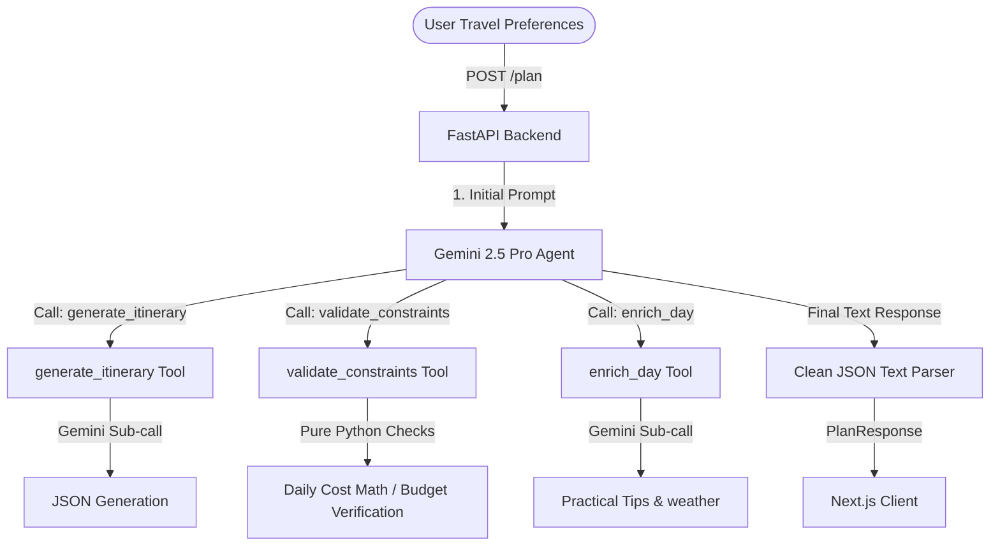

<div align="center">
  
  <br><br>
  <p>
    
    
    
    
    
    
  </p>
</div>

**VoyagerAI** is a production-grade, constraint-aware travel planning engine built for the **PromptWars (Build with AI)** challenge. It ingests user preferences, schedules, dietary needs, and financial boundaries to generate dynamic, structured day-by-day itineraries with localized tips, packing lists, and day-specific replanning — all powered by a single **Gemini 2.5 Pro** agent loop.

---

## Key Features

- **Granular Itineraries** — Every day broken into Morning, Afternoon, and Evening blocks with activities, locations, costs, and durations
- **Automated Budget Audit** — Pure-Python math processor validates daily costs against your global spending limit
- **Day-by-Day Replanning** — Don't like a specific day? Request edits and Gemini updates just that day while re-balancing constraints
- **Localized Enrichment** — Custom tips, safety alerts, weather-appropriate packing, and visa recommendations per destination
- **State-of-the-Art Dark UI** — Glassmorphic interfaces, gradient borders, staggered animations, and fully responsive design

---

## Quick Start

### Prerequisites
- Python 3.11+, Node.js 18+

### 1. Backend

```bash
cd backend
pip install -r requirements.txt
```

Create `.env` in `backend/`:
```env
GEMINI_API_KEY=your_gemini_api_key_here
```

Start the API:
```bash
uvicorn main:app --host 0.0.0.0 --port 8000 --reload
```

### 2. Frontend

```bash
cd frontend
npm install
npm run dev
```

Open [http://localhost:3000](http://localhost:3000).

---

## Architecture



---

## Configuration

| Variable | Description |
|----------|-------------|
| `GEMINI_API_KEY` | Your Google Gemini API key |
| `GOOGLE_GENAI_USE_VERTEXAI` | Set to `false` for API key auth |

---

## Contribute

PRs and ideas welcome. Open an issue or submit a pull request.
