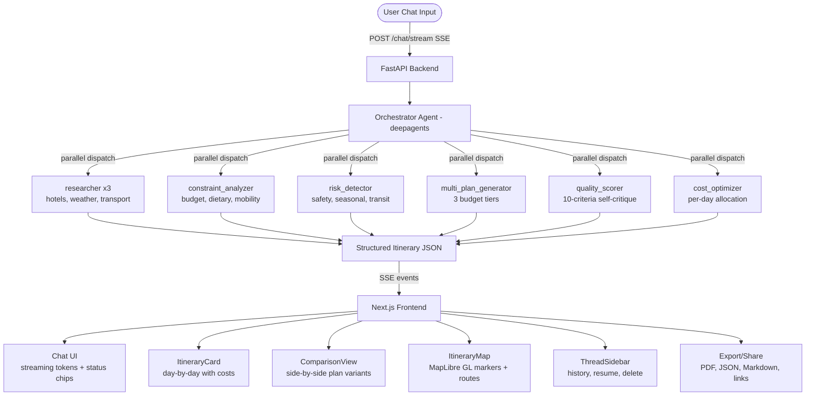

<div align="center">
  
  <br><br>
  <p>
    
    
    
    
    
    
    
    
  </p>
  <p>
    <a href="#key-features">Key Features</a> ·
    <a href="#quick-start">Quick Start</a> ·
    <a href="#architecture">Architecture</a> ·
    <a href="#testing">Testing</a> ·
    <a href="https://github.com/tanishrajput/VoyagerAI/issues">Report Bug</a> ·
    <a href="https://github.com/tanishrajput/VoyagerAI/issues">Request Feature</a>
  </p>
</div>

**VoyagerAI** is a multi-agent AI travel planning platform — 8 specialized sub-agents work in parallel to research destinations, analyze constraints, detect risks, generate multiple plan variants, self-critique quality, and present interactive itineraries with map visualization — all through a conversational chat interface.

---

## Key Features

| | |
|---|---|
| **Multi-Agent Orchestration** — 8 sub-agents work in parallel (researcher, constraint analyzer, risk detector, quality scorer, cost optimizer, and more) | **Interactive Itinerary Cards** — Day-by-day breakdown with morning/afternoon/evening slots, costs, transport, tips, warnings |
| **Multi-Plan Comparison** — Budget vs balanced vs premium tiers side-by-side with tradeoff highlights | **Self-Critique Loop** — Quality scorer evaluates against 10 criteria, applies fixes, re-scores (max 2 iterations) |
| **Map Visualization** — MapLibre GL with per-day route lines, numbered markers, cost popups, Google Maps deep links | **Thread Management** — Save, resume, delete, pin, and branch past conversations with AI-generated summaries |
| **Memory & Preferences** — Agent remembers dietary, budget, and mobility preferences across sessions | **Export & Sharing** — PDF print, JSON/Markdown/iCal export, shareable read-only links with expiry |
| **6-Language Support** — English, Hindi, Japanese, Spanish, French, German with locale-aware currency | **Google OAuth** — Real authentication with per-user data isolation |
| **Offline Support** — Cached thread history, message queueing when offline, auto-sync on reconnect | **Provider-Agnostic LLM** — Swap between Gemini, OpenAI, Anthropic, etc. via env vars |

---

## Tech Stack

| Layer | Technologies |
|---|---|
| **Backend** | Python 3.11+, FastAPI, deepagents, LangGraph, LiteLLM, Redis, Tavily, Pydantic |
| **Frontend** | Next.js 16, React 19, TypeScript, Tailwind CSS v4, next-intl, MapLibre GL, Framer Motion |
| **Infra** | Docker, SQLite fallback, Prometheus metrics, structured JSON logging |

---

## Quick Start

### Prerequisites

- Python 3.11+, Node.js 18+, Redis (optional but recommended)

### 1. Clone

```bash
git clone https://github.com/tanishrajput/VoyagerAI.git
cd VoyagerAI
```

### 2. Backend

```bash
cd backend
pip install -r requirements.txt
cp .env.example .env
# Edit .env — set at least one LLM provider API key
uvicorn main:app --host 0.0.0.0 --port 8000 --reload
```

### 3. Frontend

```bash
cd frontend
npm install
cp .env.example .env.local
npm run dev
```

Open [http://localhost:3000](http://localhost:3000).

### 4. Redis (optional)

Without Redis, the app falls back to in-memory storage (no persistence across restarts).

```bash
# macOS
brew install redis-stack-server
brew services start redis-stack-server
```

---

## Configuration

### Backend (`backend/.env`)

See [`backend/.env.example`](backend/.env.example) for all options. Key settings:

| Variable | Description | Default |
|----------|-------------|---------|
| `GEMINI_API_KEY` | Google Gemini API key | — |
| `LLM_ORCHESTRATOR_MODEL` | LiteLLM model string for orchestrator | `gemini/gemini-2.5-pro` |
| `LLM_SUBAGENT_MODEL` | LiteLLM model string for sub-agents | `gemini/gemini-3.5-flash` |
| `TAVILY_API_KEY` | Tavily search API key (for research sub-agents) | — |
| `REDIS_URL` | Redis connection URL | `redis://localhost:6379/0` |
| `CHECKPOINTER_BACKEND` | Checkpoint storage: `redis`, `sqlite`, or `memory` | `redis` |
| `AUTH_DEV_BYPASS` | Skip OAuth, use mock user `dev@localhost` | `false` |
| `GOOGLE_CLIENT_ID` | Google OAuth client ID (required for production) | — |
| `GOOGLE_CLIENT_SECRET` | Google OAuth client secret | — |
| `SESSION_SECRET_KEY` | Session encryption key (change in production!) | `dev-only-insecure-key...` |
| `CORS_ORIGINS` | Comma-separated allowed origins | `http://localhost:3000` |
| `LOG_FORMAT` | Logging format: `json` or `text` | `json` |
| `LOG_LEVEL` | Logging level | `INFO` |
| `PROMETHEUS_ENABLED` | Enable Prometheus metrics endpoint | `true` |
| `ALERT_DAILY_THRESHOLD_PCT` | Daily spend alert threshold (0-1) | `0.8` |

### Frontend (`frontend/.env.local`)

| Variable | Description | Default |
|----------|-------------|---------|
| `NEXT_PUBLIC_API_URL` | Backend API URL | `http://localhost:8000` |

---

## Architecture


```mermaid
graph TD
    User([User Chat Input]) -->|POST /chat/stream SSE| API[FastAPI Backend]
    API --> Orchestrator[Orchestrator Agent - deepagents]

    Orchestrator -->|parallel dispatch| R1[researcher x3<br/>hotels, weather, transport]
    Orchestrator -->|parallel dispatch| R2[constraint_analyzer<br/>budget, dietary, mobility]
    Orchestrator -->|parallel dispatch| R3[risk_detector<br/>safety, seasonal, transit]
    Orchestrator -->|parallel dispatch| R4[multi_plan_generator<br/>3 budget tiers]
    Orchestrator -->|parallel dispatch| R5[quality_scorer<br/>10-criteria self-critique]
    Orchestrator -->|parallel dispatch| R6[cost_optimizer<br/>per-day allocation]

    R1 --> Itinerary[Structured Itinerary JSON]
    R2 --> Itinerary
    R3 --> Itinerary
    R4 --> Itinerary
    R5 --> Itinerary
    R6 --> Itinerary

    Itinerary -->|SSE events| Frontend[Next.js Frontend]
    Frontend --> F1[Chat UI<br/>streaming tokens + status chips]
    Frontend --> F2[ItineraryCard<br/>day-by-day with costs]
    Frontend --> F3[ComparisonView<br/>side-by-side plan variants]
    Frontend --> F4[ItineraryMap<br/>MapLibre GL markers + routes]
    Frontend --> F5[ThreadSidebar<br/>history, resume, delete]
    Frontend --> F6[Export/Share<br/>PDF, JSON, Markdown, links]
```

---

## Testing

```bash
# Backend (603 tests)
cd backend
python -m pytest

# Frontend (119 tests)
cd frontend
npx vitest run
```

---

## License

Distributed under the MIT License. See [`LICENSE`](LICENSE) for more information.
