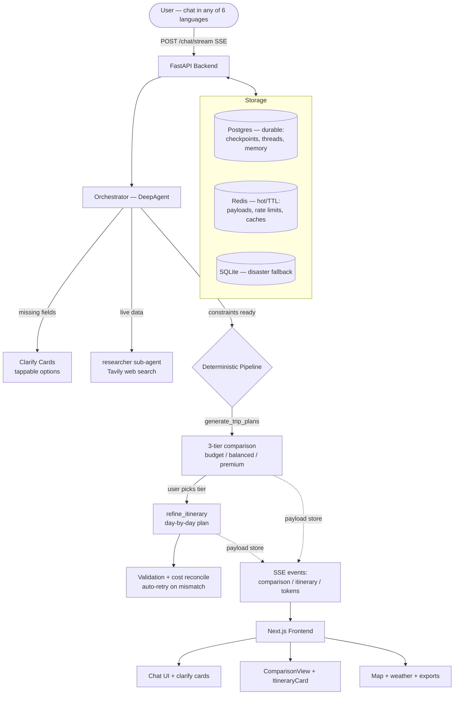

<div align="center">
  
  <br><br>
  <p>
    
    
    
    
    
    
    
    
    
  </p>
  <p>
    <a href="#key-features">Key Features</a> ·
    <a href="#quick-start">Quick Start</a> ·
    <a href="#architecture">Architecture</a> ·
    <a href="#deployment">Deployment</a> ·
    <a href="#testing">Testing</a> ·
    <a href="https://github.com/tanishrajput/VoyagerAI/issues">Report Bug</a> ·
    <a href="https://github.com/tanishrajput/VoyagerAI/issues">Request Feature</a>
  </p>
</div>

**VoyagerAI** is a conversational AI travel planner. Describe a trip in any of 6 languages — the agent asks clarifying questions, researches live data, generates three plan tiers to compare, and refines your pick into a day-by-day itinerary with real costs, maps, weather, and practical tips. A deterministic generation pipeline with validation and retries guarantees the plan you asked for is the plan you get.

---

## Key Features

| | |
|---|---|
| **Conversational Planning** — Chat naturally; tappable option cards collect destination, days, budget, style, and group | **Deterministic Plan Pipeline** — Structured generation with validation, automatic retries, and cost reconciliation — the model never freehands plan JSON |
| **Multi-Plan Comparison** — Budget vs balanced vs premium tiers side-by-side, with per-tier regeneration and "why this tier" explanations | **Live Web Research** — Tavily-powered researcher sub-agent fetches current prices, weather, and local info |
| **Interactive Itineraries** — Day-by-day slots with costs, transport, tips; manual edits validated with a diff view of adjustments | **Map Visualization** — MapLibre GL per-day routes, numbered markers, approximate-location pins, Google Maps deep links |
| **Threads & History** — Save, resume, pin, search, and branch conversations — fully durable across restarts | **Memory & Preferences** — Per-user dietary, budget, and mobility preferences persist across sessions |
| **6 Languages** — English, Hindi, Japanese, Spanish, French, German — including native-script numerals and slang | **Export & Sharing** — PDF print, JSON/Markdown/iCal export, read-only share links with expiry |
| **Google OAuth + API-Key Auth** — Real authentication with per-user data isolation | **Provider-Agnostic LLM** — LiteLLM model factory: swap Gemini, OpenAI, Anthropic via env vars, with fallback routing |
| **Offline Resilience** — PWA installable; cached history, message queueing, idempotent retries, self-healing chunk errors | **Production Ops** — Rate limits, daily cost caps, circuit breaker, Prometheus metrics, admin cost/observability dashboards |

---

## Tech Stack

| Layer | Technologies |
|---|---|
| **Backend** | Python 3.11+, FastAPI, deepagents, LangGraph, LiteLLM, psycopg, Redis, Tavily, Pydantic |
| **Frontend** | Next.js 16 (Turbopack), React 19, TypeScript, Tailwind CSS v4, next-intl, MapLibre GL, Framer Motion, Recharts |
| **Storage** | PostgreSQL (durable) · Redis (hot/TTL) · SQLite (disaster fallback) |
| **Infra** | Docker, Prometheus metrics, structured JSON logging |

---

## Quick Start

### Prerequisites

- Python 3.11+, Node.js 18+
- Optional: PostgreSQL (e.g. Supabase) and Redis (e.g. Upstash) — without them the app runs on SQLite + in-memory fallbacks

### 1. Clone

```bash
git clone https://github.com/tanishrajput/VoyagerAI.git
cd VoyagerAI
```

### 2. Backend

```bash
cd backend
pip install -r requirements.txt
cp .env.example .env
# Edit .env — set at least one LLM provider API key
uvicorn main:app --host 0.0.0.0 --port 8000 --reload
```

### 3. Frontend

```bash
cd frontend
npm install
cp .env.example .env.local
npm run dev
```

Open [http://localhost:3000](http://localhost:3000).

### 4. Storage tiers (optional)

Set `DATABASE_URL` (Postgres) for durable threads/checkpoints/memory and `REDIS_URL` for hot caching. Both absent → SQLite + in-memory, fully functional but not persistent across deploys.

---

## Configuration

### Backend (`backend/.env`)

See [`backend/.env.example`](backend/.env.example) for all options. Key settings:

| Variable | Description | Default |
|----------|-------------|---------|
| `GEMINI_API_KEY` / `OPENAI_API_KEY` / `ANTHROPIC_API_KEY` | LLM provider keys (set whichever your models use) | — |
| `LLM_ORCHESTRATOR_MODEL` | LiteLLM model string for the orchestrator | `gemini/gemini-3.7-flash` |
| `LLM_SUBAGENT_MODEL` | LiteLLM model string for the researcher sub-agent | `gemini/gemini-3.5-flash-lite` |
| `LLM_ORCHESTRATOR_FALLBACK` / `LLM_SUBAGENT_FALLBACK` | Fallback models on provider errors | — |
| `TAVILY_API_KEY` | Tavily search API key (live research) | — |
| `GOOGLE_MAPS_API_KEY` | Google Maps / geocoding key | — |
| `DATABASE_URL` | Postgres connection string (durable tier) | — |
| `REDIS_URL` | Redis connection URL (hot/TTL tier) | — |
| `CHECKPOINTER_BACKEND` | LangGraph checkpoints: `postgres`, `redis`, `sqlite`, `memory` | `postgres` |
| `STORE_BACKEND` | Agent memory store: `postgres`, `redis`, `memory` | `postgres` |
| `AUTH_MODE` | `production` (Google OAuth) or `development` (mock user) | `development` |
| `API_AUTH_KEY` | Shared frontend↔backend API key | — |
| `GOOGLE_CLIENT_ID` / `GOOGLE_CLIENT_SECRET` | Google OAuth credentials (production) | — |
| `SESSION_SECRET_KEY` | Session encryption key (change in production!) | `dev-only-...` |
| `CORS_ORIGINS` | Comma-separated allowed origins | `http://localhost:3000` |
| `DAILY_COST_CAP_USD` / `HOURLY_PLATFORM_CAP_USD` | Per-user daily cap / platform hourly circuit breaker | — |
| `PROMETHEUS_ENABLED` | Expose `/metrics` endpoint | `true` |

### Frontend (`frontend/.env.local`)

| Variable | Description | Default |
|----------|-------------|---------|
| `NEXT_PUBLIC_API_URL` | Backend API URL | `http://localhost:8000` |
| `NEXT_PUBLIC_API_AUTH_KEY` | Must match backend `API_AUTH_KEY` | — |
| `NEXT_PUBLIC_GOOGLE_MAPS_API_KEY` / `NEXT_PUBLIC_GOOGLE_MAPS_MAP_ID` | Map rendering | — |

---

## Architecture


```mermaid
graph TD
    User([User — chat in any of 6 languages]) -->|POST /chat/stream SSE| API[FastAPI Backend]
    API --> Orch[Orchestrator — DeepAgent]

    Orch -->|missing fields| Clarify[Clarify Cards<br/>tappable options]
    Orch -->|live data| Researcher[researcher sub-agent<br/>Tavily web search]
    Orch -->|constraints ready| Pipe{Deterministic Pipeline}

    Pipe -->|generate_trip_plans| Tiers[3-tier comparison<br/>budget / balanced / premium]
    Tiers -->|user picks tier| Refine[refine_itinerary<br/>day-by-day plan]
    Refine --> Validate[Validation + cost reconcile<br/>auto-retry on mismatch]

    Tiers -.->|payload store| SSE
    Refine -.->|payload store| SSE
    SSE[SSE events:<br/>comparison / itinerary / tokens] --> Frontend[Next.js Frontend]
    Frontend --> F1[Chat UI + clarify cards]
    Frontend --> F2[ComparisonView + ItineraryCard]
    Frontend --> F3[Map + weather + exports]

    subgraph Storage
        PG[(Postgres — durable:<br/>checkpoints, threads, memory)]
        RD[(Redis — hot/TTL:<br/>payloads, rate limits, caches)]
        SQ[(SQLite — disaster fallback)]
    end
    API <--> Storage
```

Plan JSON never travels through model text — pipeline payloads go through a TTL store and arrive as structured SSE events. History replays restore cards exactly.

---

## Deployment

**Backend** — ships as a Docker image (`backend/Dockerfile`, port 7860), deployed on Hugging Face Spaces. Set env secrets (LLM keys, `DATABASE_URL`, `REDIS_URL`, `API_AUTH_KEY`, OAuth, session secret) in Space settings — use the Supabase **Session Pooler** URL for `DATABASE_URL` (direct host needs IPv6).

**Frontend** — deployed on Vercel. Set `NEXT_PUBLIC_API_URL`, `NEXT_PUBLIC_API_AUTH_KEY`, and maps envs.

---

## Testing

```bash
# Backend (~760 tests)
cd backend
python -m pytest
ruff check .

# Frontend (~500 tests)
cd frontend
npx vitest run
npx tsc --noEmit
```

---

## API Docs

Per-endpoint documentation lives in [`backend/docs/`](backend/docs/) — chat streaming, threads, sharing, auth, uploads, export, preferences, feedback, admin, ops.

---

## License

Distributed under the MIT License. See [`LICENSE`](LICENSE) for more information.
